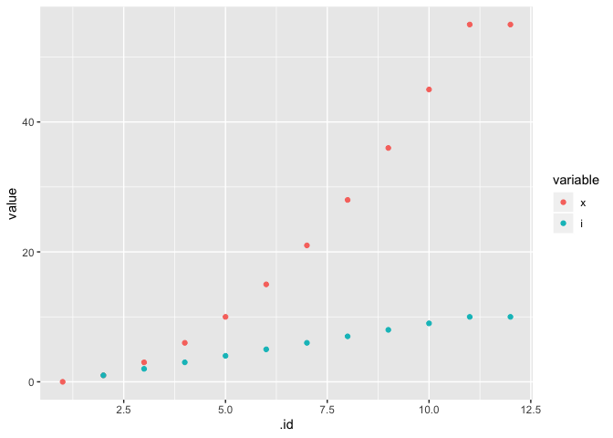

<!-- README.md is generated from README.Rmd. Please edit that file 

library(rmarkdown)
render('README.Rmd', output_format=md_document())

-->
watcher - Record Function State During Evaluation
=================================================

Overview
--------

A mechanism to record function state during evaluation for later
analysis. Variable values and meta data are recorded for each
‘top-level’ call. Top-level calls are, roughly speaking, distinct R
expressions that are visible directly in the source of the R function.

This is package is experimental, rough around the edges, and not
currently intended for CRAN publication. It has no tests, and was built
with expediency rather than robustness as the guiding principle. The API
may change completely in future iterations if there are any. More likely
there will be no future updates to the project, except in the unlikely
case it garners substantial interest from others.

Usage
-----

`watcher` works by “instrumenting” a target function. Consider a simple
function that adds the integers up to `n`:

    seq_sum <- function(n) {
      x <- 0
      for(i in seq_len(n)) {
        x <- x + i
      }
      x
    }
    res0 <- seq_sum(10)
    res0

    ## [1] 55

We can make an instrumented version of it, which will behave mostly as
the original except that the variable values at each top-level
evaluation step are attached to the result as the “watch.data”
attribute:

    seq_sum_w <- watcher::watch(seq_sum)
    res1 <- seq_sum_w(10)
    all.equal(res0, res1, check.attributes=FALSE)

    ## [1] TRUE

    watch.dat0 <- attr(res1, 'watch.data')
    str(watch.dat0[1:2])

    ## List of 2
    ##  $ :List of 2
    ##   ..$ x: num 0
    ##   ..$ n: num 10
    ##   ..- attr(*, "line")= int 2
    ##  $ :List of 3
    ##   ..$ i: int 1
    ##   ..$ x: num 1
    ##   ..$ n: num 10
    ##   ..- attr(*, "line")= int 4

Each step of the function evaluation is recorded as a list element. This
is a bit awkward to deal with so we can use `simplify_data` to make the
data more accessible. For example, scalar variables are turned into
vectors and returned as members of the “.scalar” data frame in the
simplified list.

    watch.dat1 <- watcher::simplify_data(watch.dat0)[['.scalar']]
    head(watch.dat1, 2)

    ##   .id .line x  n  i
    ## 1   1     2 0 10 NA
    ## 2   2     4 1 10  1

One possible visualization is to plot variable values vs. evaluation
step (`.id`):

    watch.melt <- reshape2::melt(watch.dat1[c('.id', 'x', 'i')], id.vars='.id')
    suppressPackageStartupMessages(library(ggplot2))
    ggplot(watch.melt, aes(x=.id, y=value, color=variable)) +
      geom_point()

Code And Data
-------------

With a little work we can combine the line information with the function
data as we do here with an animation of the insertion sort algorithm:

For more details on how this is done see the vignette
(`vignette('watcher', package='watcher')`).

Possible Improvements
---------------------

-   Handle nested/recursive calls. Conceptually this isn’t too
    difficult: we just need to add a call that checks `.res` for the
    `watch.*` attributes after each top level statement. Simplification
    / visualization will be another matter.
-   Protect the symbols used in tracking (i.e. `.res`, `.line`, `.id`)
    to avoid conflicts with existing variables of the same name (or at
    least check for conflict).
-   Automate more of what can be automated, particularly the code / plot
    juxtaposition.
-   Optimize code; currently we’ve made no effort to make the code
    efficient.

Acknowledgements
----------------

-   [Jim Hester](https://github.com/jimhester/) for the instrumentation
    concept which I borrowed from
    [`covr`](https://github.com/r-lib/covr); if you are interested in
    writing your own instrumented code please base it off of his and not
    mine as I just threw something together quickly with little thought.
-   [Thomas Lin Pedersen](https://github.com/thomasp85) for
    [`gganimate`](https://github.com/thomasp85/gganimate/) which I used
    for the insertion sort animation.
-   [Hadley Wickham](https://github.com/hadley/) for
    [`ggplot`](https://github.com/tidyverse/ggplot2).
